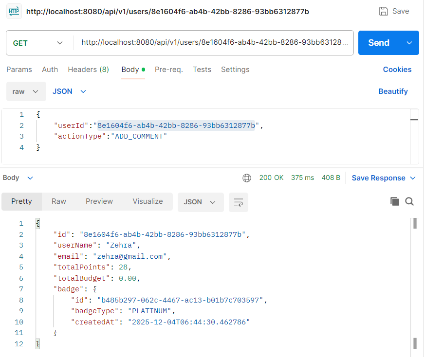
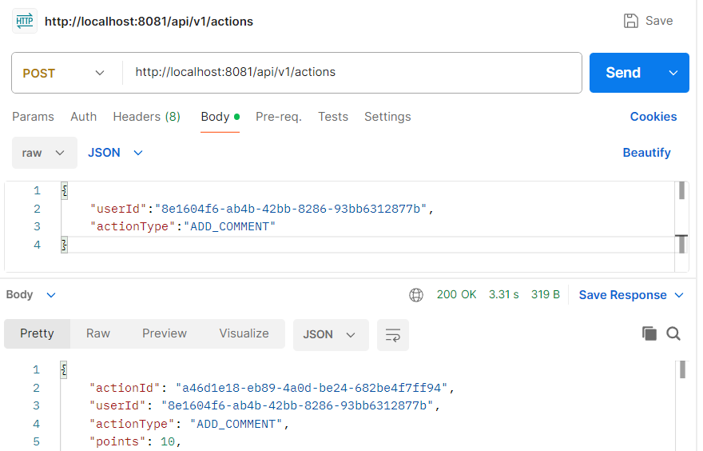
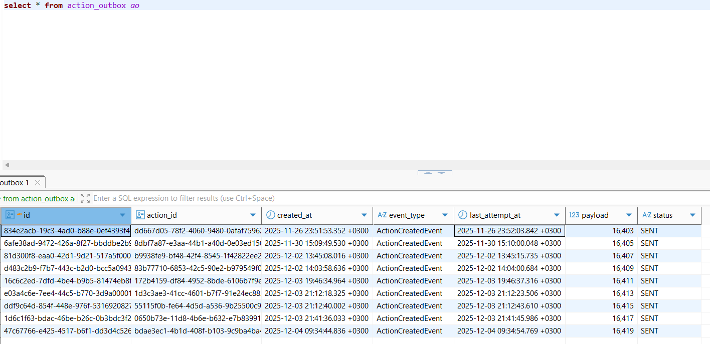

<h1 align="center">🧩 User Points & Badge System</h1>

<i>Kullanıcı puan & rozet yönetimi — Event-Driven Mikroservis Mimarisi</i>

 

<h2>🚀 Mimari Özeti</h2>

<ul>
  <li><b>🟦 User-Service </b>
    <ul>
      <li>Kullanıcı oluşturma</li>
      <li>Puan ekleme</li>
      <li>Profil bilgisini <b>rozet ile birlikte</b> döndürme</li>
      <li>Badge-Service ile Feign üzerinden iletişim</li>
    </ul>
  </li>

  <li><b>🟨 Action-Service </b>
    <ul>
      <li>Kullanıcı aksiyonlarını toplama</li>
      <li>Kullanıcıya puan ekleme</li>
      <li><b>Transactional Outbox Pattern</b> ile Kafka’ya event gönderme</li>
    </ul>
  </li>

  <li><b>🟪 Badge-Service </b>
    <ul>
      <li>Kafka <code>action-events</code> tüketme</li>
      <li>Kullanıcının toplam puanını User-Service üzerinden çekme</li>
      <li>Puan eşiklerine göre doğru rozeti hesaplama</li>
      <li>Eski rozetleri silip yeni rozeti kaydetme</li>
      <li>User-Service’e “badge updated” bildirimi gönderme</li>
    </ul>
  </li>
</ul>

 

<h2>🏅 Rozet Hesaplama Mantığı</h2>

<pre><code>
if (points >= 20) PLATINUM;
else if (points >= 15) GOLD;
else if (points >= 5)  SILVER;
else                  BRONZE;
</code></pre>

Her kullanıcı sistemde <b>yalnızca bir güncel rozet</b> taşır.

 

<h2>📡 Event Akışı (Kısa Özet)</h2>

<ol>
  <li>Action-Service: Aksiyon oluşturur</li>
  <li>User-Service: Kullanıcıya puan ekler</li>
  <li>Outbox: Kafka’ya event yollar</li>
  <li>Badge-Service: Event’i dinler ve rozet belirler</li>
  <li>Rozet DB’ye kaydedilir</li>
  <li>User profil endpoint'i → rozet ile birlikte döner</li>
</ol>

 

<h2>🛠 Kullanılan Teknolojiler</h2>

<ul>
  <li>Java 21</li>
  <li>Spring Boot</li>
  <li>Spring Cloud Stream (Kafka)</li>
  <li>Feign Client</li>
  <li>PostgreSQL</li>
  <li>Docker Compose</li>
</ul>

 

<h2>🧪 API Test — Postman Çıktıları</h2>

Projede bulunan mikroservislerin uçtan uca başarıyla çalıştığını doğrulamak için Postman üzerinden testler yapılmıştır. Aşağıdaki ekran görüntüleri, Action-Service → User-Service → Kafka → Badge-Service akışının sorunsuz işlendiğini göstermektedir.

 

<h3>🔹 1. Kullanıcı Profilini Rozet ile Görüntüleme</h3>

  

Yukarıdaki örnekte, kullanıcının toplam 28 puana ulaştığı ve Badge-Service tarafından otomatik olarak <b>PLATINUM</b> rozeti atandığı görülmektedir.

 

<h3>🔹 2. Kullanıcıya Aksiyon Gönderme (Action-Service)</h3>

  

Bu istekte Action-Service başarılı şekilde action üretmiş, puanı hesaplamış ve User-Service'e iletmiştir. Ardından action, <b>Transactional Outbox Pattern</b> sayesinde Kafka'ya event olarak aktarılmıştır.

 

<h3>🔹 3. Transactional Outbox — Veritabanı Kayıtları</h3>

  

Bu tablo, oluşturulan aksiyonların Kafka’ya gönderilmeden önce <code>action_outbox</code> tablosunda <b>SENT</b> durumuyla işlendiğini göstermektedir. Bu mekanizma, event-driven akışın veri tutarlılığını garanti eder.

 

